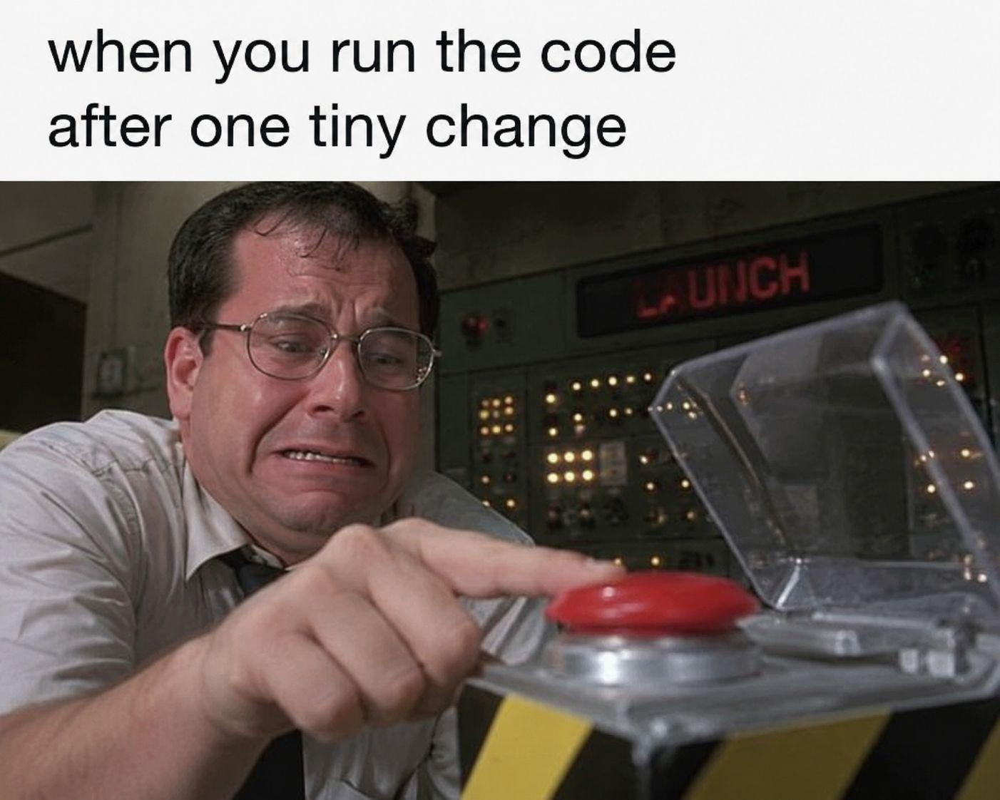

When you hit a brick wall while coding, your first instinct shouldn't be to immediately run to a forum or ask someone to fix it for you. Personally, whenever I run into a bug or a confusing error message, my first steps are searching on Google, reviewing documentation on W3Schools, watching YouTube tutorials, or using Gemini to explain tricky concepts. As Eric S. Raymond points out in his essay *How To Ask Questions The Smart Way*, open-source communities and senior developers aren't paid help desks. Demonstrating that you did basic homework first shows respect for other people's time and builds your own problem-solving skills.

## My Debugging Process and the Friction of Manual Checks

Coming into ICS 314 with a Java and C++ background from my freshman year, I was used to clear compiler error messages pointing out exact line numbers. Working on our GitHub portfolios, however, gave me a whole new appreciation for manual troubleshooting. GitHub’s web editor doesn't give you real-time syntax error warnings. When a page layout broke or a tag didn't render properly, I had to sit there and read through my Markdown files line-by-line to find a missing quote or broken HTML tag. Dealing with that frustration forced me to get much better at isolating my own bugs before jumping straight to asking for help.

## Anatomy of a Smart Question

In his essay, Raymond says that asking a question "the smart way" requires showing prior effort, giving precise context, and providing minimal reproducible code. A great example of this on StackOverflow is [Why does TypeScript lose the correlation between a discriminant and a generic payload?](https://stackoverflow.com/questions/68370908/why-does-typescript-lose-the-correlation-between-a-discriminant-and-a-generic-p).

The author followed key best practices:

* **Specific Title:** The title clearly defines the exact technical edge case in TypeScript rather than being vague.
* **Minimal Code Example:** They provided a concise code block showing how standard discriminated unions work in a function versus where TypeScript fails to preserve that relationship when generics are introduced.
* **Demonstrated Understanding:** Instead of asking someone to write their code for them, they isolated the exact compiler behavior they were struggling to understand.

Because the poster provided clean context and proved they did their homework, the community was able to immediately connect the issue to existing solutions regarding TypeScript generic narrowing constraints.

## Anatomy of a "Not So Smart" Question

On the flip side, a bad question usually lacks basic context, shows zero prior effort, and demands immediate answers without giving people anything to work with.

Consider this classic example of a bad post:

> **Title:** MY CODE IS BROKEN PLEASE HELP NOW!!  
> **Body:** I am trying to write a TypeScript function for my class assignment and it keeps giving me an error. Why is this not working? Here is my code: `function process(x) { return x.map(i => i.value); }`

This post breaks almost every rule in Raymond's essay:

* **Vague & Loud Title:** Using all caps and tags like "NOW" displays entitlement rather than clarity.
* **Missing Error Details:** The poster never stated what the error message actually said or what line triggered it.
* **No Environment Context:** They failed to mention compiler settings or type definitions.
* **Zero Effort Shown:** There is no mention of debugging steps, Google searches, or what they tried before posting.

A question like this predictably gets downvoted, closed, or ignored because nobody can help without guessing.

## Final Thoughts

Comparing these two approaches reinforces a key lesson for software engineering: the quality of the answer you get depends entirely on the quality of the question you ask. Taking five minutes to isolate a bug, organize your code, and explain what you've already tried saves time for everyone involved—and half the time, taking those steps helps you spot the mistake on your own anyway.

*Note: AI was used to assist with grammar fixes.*
