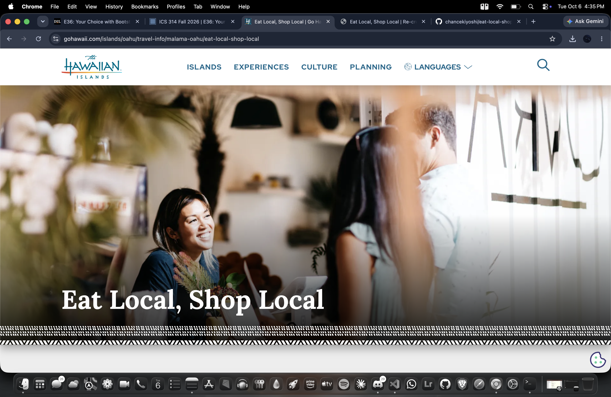

When you start learning web development, raw HTML and CSS feel simple. You write a tag, add a styling rule, and see immediate results. But as projects grow to fit desktops, tablets, and smartphones, raw CSS quickly becomes a headache of media queries and layout bugs.

In ICS 314, my introduction to UI frameworks came through Bootstrap 5. Learning a framework initially felt like learning a whole new language filled with custom class names and grid rules. But after using it, the benefits over plain HTML and CSS became clear.

## Why Use Bootstrap 5?

Making a website look good across all screen sizes in vanilla CSS requires constant manual tweaking. Bootstrap 5 solves this through built-in standardization:

* **Automatic Responsiveness:** Layouts adapt smoothly whether viewed on a phone or a desktop PC.
* **Boilerplate Shortcuts:** Built-in starter templates let you jump straight to building components instead of setting up CSS from scratch.
* **Readable Structure:** Standard classes like `container`, `row`, and `col-md-6` make layout intent easy for any developer to read.

## Hands-On Experience: Re-creating GoHawaii

The practical value of Bootstrap 5 became obvious during our E36 practice WOD, where we recreated the *GoHawaii* "Eat Local, Shop Local" page. While my version wasn't a perfect replica of the original, Bootstrap made building the core structure much faster:

1. **Hero Banner:** Used a fluid container to place text neatly over a background image.
2. **Card Grids:** Structured sections like *Neighborhoods*, *Farmers' Markets*, and *Mementos of Aloha* using Bootstrap's grid system so they stack on mobile and sit side-by-side on desktop.
3. **Utility Classes:** Used built-in padding and alignment classes to keep spacing clean without writing extra CSS lines.

Building this same layout from scratch with raw CSS would have taken far more trial and error.

## The Software Engineering Perspective

In software engineering, you rarely build foundational tools from scratch when tested libraries already exist. Frontend design is no different. Bootstrap 5 abstracts complex grid math and browser compatibility into simple, reusable classes. This lets developers focus on core app features and user experience rather than fighting CSS positioning.

## Conclusion

While Bootstrap 5 has an initial learning curve, the payoff in development speed, device responsiveness, and cleaner code is worth it. Re-creating the GoHawaii page showed me that frameworks give you a polished, responsive baseline in a fraction of the time raw CSS requires.

---

* Note on AI Assistance: English is not my first language, so I used Gemini to help refine my grammar. All of the personal experiences and opinions described here are my own. *
