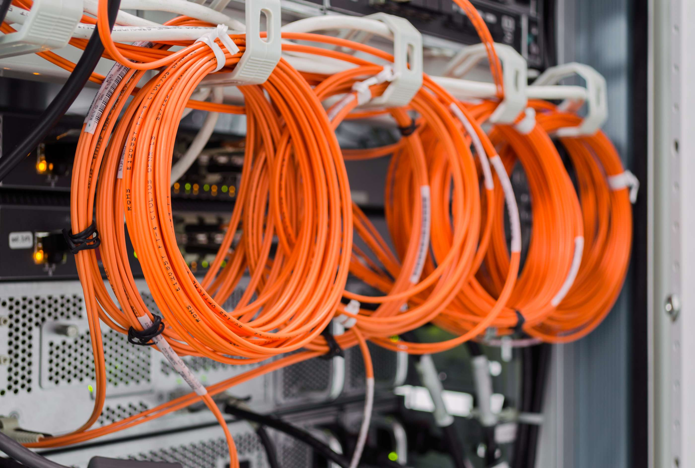

During my time as an IT Specialist at College of Micronesia-FSM, I participated in a major physical infrastructure overhaul to connect isolated campus buildings directly to the main network backbone. Many facilities lacked fiber optic connectivity, resulting in serious bandwidth bottlenecks. To fix this, our team undertook the massive task of running fresh fiber cables underground across the entire campus.

Executing this installation was a physically demanding and challenging effort. Working long hours under intense sun, heat, and humidity, we constantly battled difficult ground conditions—including thick mud and existing broken conduit pipes along the run. My direct responsibility was managing the cable channeling: navigating the trench routes, clearing obstructions, and carefully pulling and pushing heavy-duty outdoor fiber optic lines through underground pathways across campus without damaging the delicate glass cores. While I handled the physical infrastructure and routing, my supervisor performed the final fiber terminations in the server rooms.

This project gave me deep appreciation for physical OSI Layer 1 infrastructure and the harsh realities of field deployment. I learned how environmental factors, physical cable safety, and persistent hands-on problem solving directly impact real-world network reliability before a single data packet ever moves across the wire.
